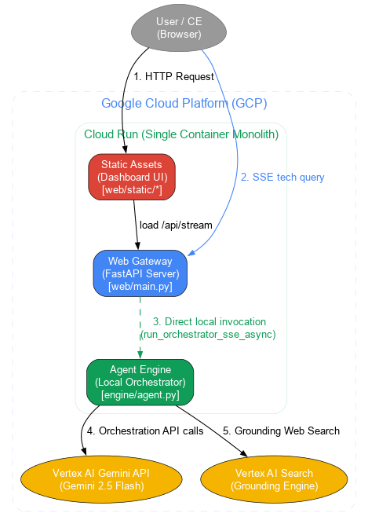

# Google Cloud QnA

구글 클라우드 관련 질문에 공식 자료를 기반으로 답변하는 에이전트다.

---

## 시스템 구성



---

## 폴더 및 파일 구조

```
google-cloud-qna/
├── Dockerfile                  # Cloud Run 빌드 지침
├── README.md                   # 프로젝트 사용 설명서
├── requirements.txt            # Python 의존성 라이브러리 목록
├── engine/                     # 지능형 엔진 소스 폴더
│   ├── agent.py                # 멀티 에이전트 오케스트레이터 및 SSE 제너레이터
│   ├── utils.py                # URL 검증, GCS 업로드, Graphviz 빌드 공통 모듈
│   └── prompts/                # 프롬프트 마크다운 관리 폴더
│       ├── evaluator_system_prompt.md    # 사실 무결성 검증 평가자 프롬프트
│       ├── gcp_arch_standards.md         # GCP 아키텍처 모범사례 가이드라인
│       ├── remediator_system_prompt.md   # 사실 왜곡 교정 보정자 프롬프트
│       ├── synthesizer_system_prompt.md  # 기술 권고안 종합 합성 아키텍트 프롬프트
│       └── pillars/                      # 8대 필라 서브 에이전트 지침 폴더
│           ├── apis_applications.md      # API 및 앱 통합 설계 지침
│           ├── application_modernization.md # GKE, 서버리스 설계 지침
│           ├── artificial_intelligence.md   # Vertex AI 및 GenAI 설계 지침
│           ├── data_analytics.md         # BigQuery, Pub/Sub 설계 지침
│           ├── databases.md              # Cloud SQL, Spanner 설계 지침
│           ├── infrastructure.md         # VPC, 로드 밸런서 설계 지침
│           ├── productivity_collaboration.md # Google Workspace 및 AppSheet 지침
│           └── security.md               # IAM 최소 권한 및 보안 경계 설계 지침
└── web/                        # FastAPI 웹 인터페이스 폴더
    ├── deploy.sh               # 빌드/배포 및 구버전 리비전 청소 스크립트
    ├── main.py                 # SSE 라우터 포팅 웹 서버 엔트리포인트
    └── static/                 # 프론트엔드 정적 리소스 폴더
        ├── app.js              # SSE 스트리밍 UI 실시간 업데이트 스크립트
        ├── index.html          # 메인 포털 마크업 (Glassmorphism UI)
        └── style.css           # 스타일시트 (프리미엄 테마 정의)
```

---

## 퀵 스타트

### 1. 사전 권한 확보 및 환경 변수 설정
에이전트가 정상적으로 구글 검색 그라운딩 및 Gemini API를 호출할 수 있도록 아래와 같이 `~/.env` 파일을 작성하여 환경 변수를 셋팅한다.

`~/.env` 파일 예시:
```env
GCP_PROJECT="your-gcp-project-id"
GCP_REGION="us-central1"
GCS_BUCKET="your-gcs-bucket-name"
MODEL_AGENT="gemini-3.5-flash"
MODEL_LOCATION="global"
MODEL_SUBAGENTS="gemini-3.5-flash"
```

### 2. 로컬 테스트 및 실행
단일 컨테이너 아키텍처로 통합되어 로컬 테스트도 간단하다.
```bash
# 의존성 패키지 설치
pip install -r requirements.txt

# Uvicorn 서버를 사용한 로컬 구동
uvicorn web.main:app --host 0.0.0.0 --port 8080 --reload
```

### 3. 빌드 및 배포 자동화 실행
복잡한 수동 배포 단계 없이 제공되는 단일 쉘 스크립트를 통해 배포를 끝마친다.
```bash
# 최상위 루트 디렉터리로 컨텍스트를 지정하여 릴리즈 수행
./web/deploy.sh
```

배포가 끝나면 터미널 창에 반환되는 통합 포털 URL 주소로 즉시 접속하여 사용한다.  
- 배포 주소 예시: [https://google-cloud-qna-gb3apzhmla-uc.a.run.app](https://google-cloud-qna-gb3apzhmla-uc.a.run.app)
